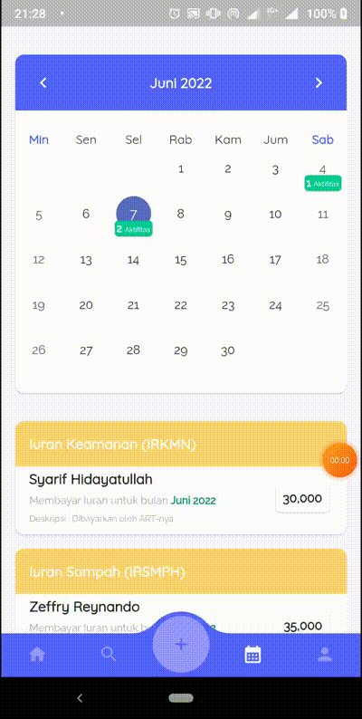

  

# Yuuran
Application to manage dues in Kampung Kepu GG Marwah. This is final project Associate’s degree System Information Universitas Bina Sarana Informatika.

## Feature

- [x] Onboarding
- [x] Login
- [x] Statistic Iuran
- [x] Recent Activity Transaction
- [x] Search Citizen
- [x] List Dues by Citizen
- [x] Calendar Activity
- [x] Account Page (Logout & About Application)
- [x] Management Iuran Category
- [x] Management Iuran Transaction

<table>
    <tbody>
        <tr>
			<td>
				

					<h3>Onboarding</h3>
					
				

			</td>
			<td>
				

				<h3>Login</h3>
				
				

			</td>
		</tr>
		<tr>
			<td>
				

				<h3>Home</h3>
				
				

			</td>
			<td>
				

				<h3>Search</h3>
				
				

			</td>
		</tr>
		<tr>
			<td>
				

				<h3>Citizen Dues</h3>
				
				

			</td>
			<td>
				

				<h3>Calendar</h3>
				
				

			</td>
		</tr>
		<tr>
			<td>
				

				<h3>Management Iuran Transaction</h3>
				
				

			</td>
			<td>
				

				<h3>Management Iuran Category</h3>
				
				

			</td>
		</tr>
	</tbody>
</table>

## Issues

Please file any issues, bugs or feature request as an issue on <a href="https://github.com/zgramming/Yuuran/issues"><b> Github </b></a>

## Contributing

Pull requests are welcome. For major changes, please open an issue first to discuss what you would like to change.

<table border="0" cellspacing="0" cellpadding="0">
    <thead>
        <tr>
            <th>Github</th>
            <th>LinkedIn</th>
            <th>Facebook</th>
            <th>Instagram</th>
            <th>Website</th>
        </tr>
    </thead>
    <tbody>
        <tr>
            <td>
            
            </td>
            <td></td>
            <td></td>
            <td></td>
            <td></td>
        </tr>
    </tbody>

</table>